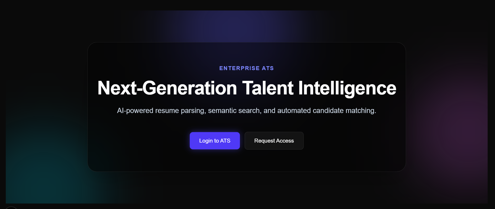
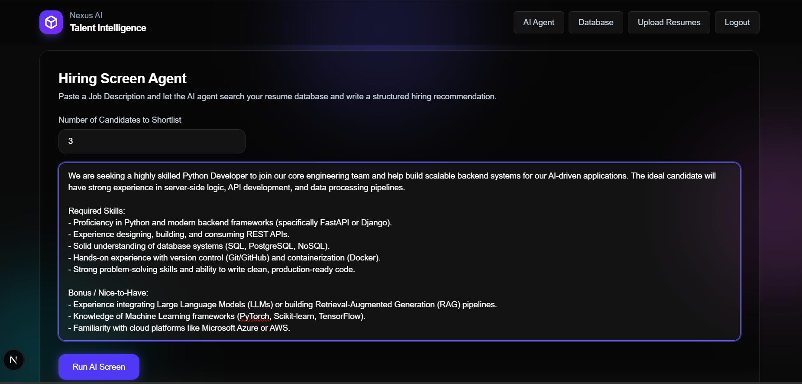
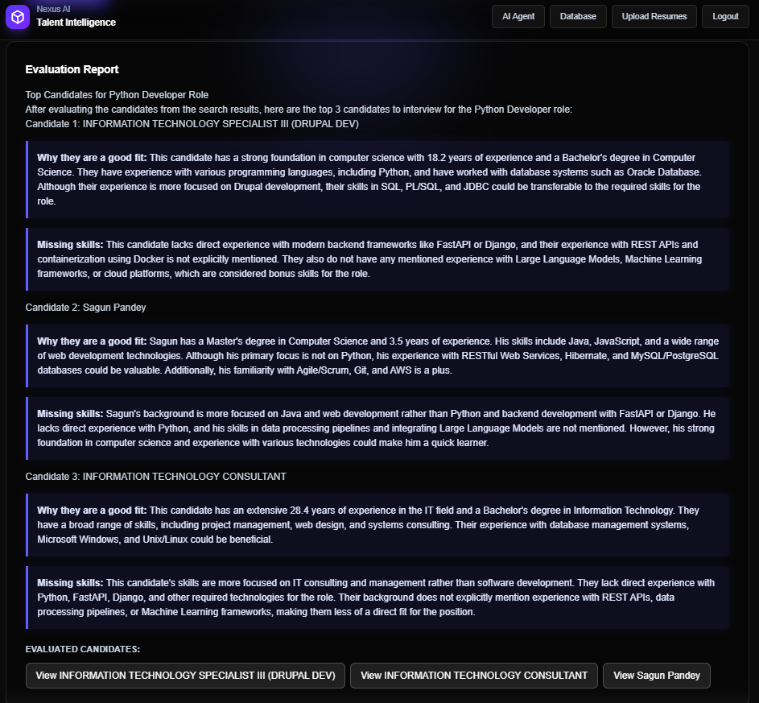
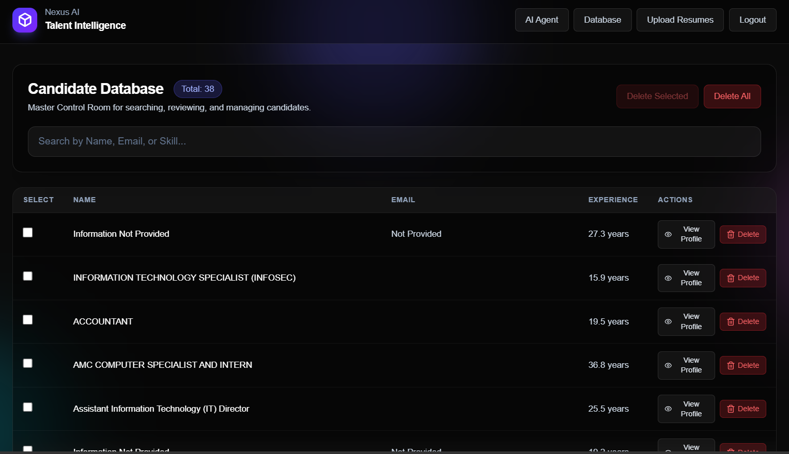
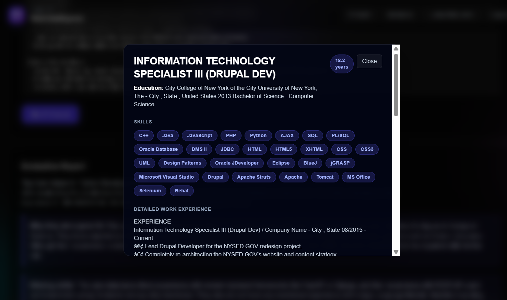
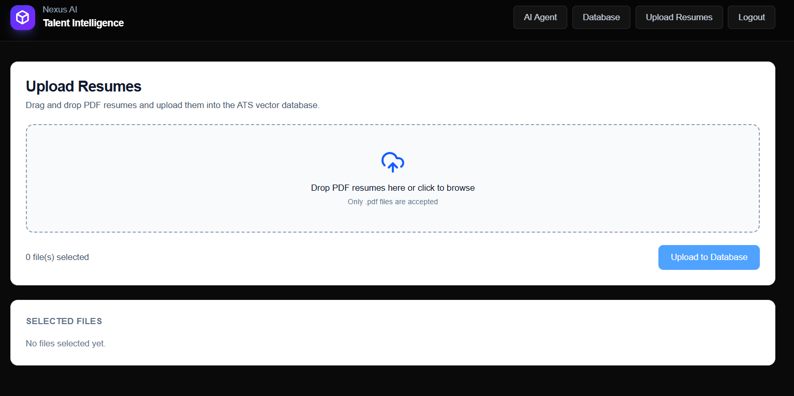
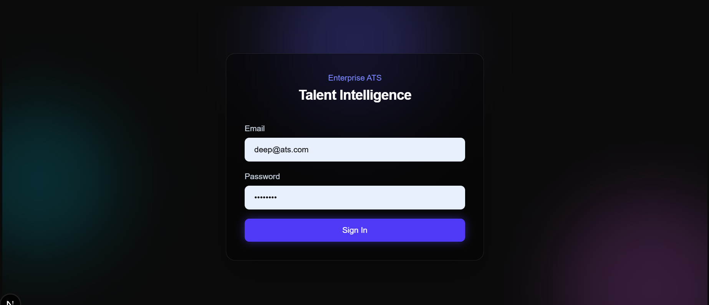

# Nexus AI: Enterprise Talent Intelligence

> A next-generation ATS powered by **RAG**, **Groq LLMs**, and a premium **Next.js** control surface for intelligent, explainable hiring decisions.




---

## ✨ Features

- **Intelligent AI Hiring Agent**  
  Accepts a job description + vacancy count, queries Qdrant via LangChain tools, and generates structured markdown evaluations with clear fit/missing-skill reasoning.

- **Zero-Hallucination Parsing Pipeline**  
  Enforces strict **Pydantic** schemas and negative extraction constraints so the LLM focuses on real resume sections (especially chronological work history) even from noisy OCR text.

- **Master Control Room**  
  Real-time dark-mode database dashboard for candidate management, live total counts, bulk actions, and rich profile modal inspection.

- **Resilient Vector Storage**  
  Implements point-based mass deletion to avoid Windows file-lock “zombie collection” failures during large data purges.

- **Dynamic UI Rendering from AI Output**  
  React logic scans generated markdown, resolves candidate mentions, removes substring false-positives, deduplicates by identity, and renders interactive **View Profile** actions.

---

## 🖼️ Platform Showcase

### AI Agent



### Candidate Database



### Upload & Auth



---

## 🧠 Architecture Flow

Nexus AI follows a retrieval-augmented hiring loop:

1. **Upload (Next.js)**: User uploads resumes from the frontend.
2. **Parse (FastAPI + Groq)**: Backend extracts structured candidate data using strict Pydantic schemas and guarded prompts.
3. **Embed + Store (Sentence Transformers + Qdrant)**: Raw text is embedded with `all-MiniLM-L6-v2` and stored in local Qdrant with candidate payloads.
4. **Screen (AI Agent + LangChain)**: Hiring agent receives job description + candidate count, calls search tools, and retrieves top matches.
5. **Evaluate (Groq LLM)**: Agent writes markdown analysis of fit gaps and strengths.
6. **Interact (Next.js Dashboard)**: UI renders report, auto-generates profile actions, and opens detailed candidate modals.

---

## 🚀 Getting Started

### Prerequisites

- **Python** 3.10+
- **Node.js** 18+ (or 20+ recommended)
- **npm**
- Local **Qdrant** instance on `localhost:6333` (or custom host/port via env)

### Backend Setup

```bash
cd backend
python -m venv .venv
```

**Windows (PowerShell):**
```bash
.venv\Scripts\Activate.ps1
```

**macOS/Linux:**
```bash
source .venv/bin/activate
```

Install dependencies:
```bash
pip install -r requirements.txt
```

Run FastAPI:
```bash
uvicorn main:app --reload --host 0.0.0.0 --port 8000
```

Backend will be available at: `http://127.0.0.1:8000`

### Frontend Setup

```bash
cd frontend
npm install
npm run dev
```

Frontend will be available at: `http://localhost:3000`

---

## 🔐 Environment Variables

Create `backend/.env`:

```env
# LLM
GROQ_API_KEY=your_groq_api_key_here

# Qdrant
QDRANT_HOST=localhost
QDRANT_PORT=6333
QDRANT_COLLECTION_NAME=resumes

# Auth
JWT_SECRET=super-secret-ats-key

# Optional legacy auth vars (safe to keep)
ADMIN_EMAIL=admin@ats.com
ADMIN_PASSWORD=password123
```

---

## 🛠️ Technical Highlights & Learnings

- **Windows file-lock mitigation for vector DB cleanup**  
  Replaced collection-level deletion with **filter-based point deletion**, eliminating mass-delete lock failures.

- **Groq 429 rate-limit resilience**  
  Added retry-loop backoff behavior with explicit cooldown windows to keep parsing/search-query extraction stable under API pressure.

- **Strict markdown structure control in agent output**  
  Prompt constraints now enforce two separate blockquotes with an empty line between fit/missing-skill reasoning for predictable rendering.

- **Extraction precision under OCR noise**  
  Negative prompt constraints + typed schema validation significantly reduce section drift (e.g., summary text incorrectly mapped as experience).

- **Frontend post-processing of AI text**  
  Candidate mention parsing includes substring conflict filtering and identity deduplication to prevent duplicate or incorrect profile actions.

---

## 🧱 Tech Stack

- **Frontend:** **Next.js 14 (App Router)**, **React**, **Tailwind CSS** (dark glassmorphism UI)
- **Backend:** **Python**, **FastAPI**
- **AI/LLM:** **Groq API** (`llama-3.1-8b-instant`), **LangChain**
- **Vector Search:** **Qdrant** (local vector DB)
- **Embeddings:** `all-MiniLM-L6-v2`

---

## 📌 Project Positioning

Nexus AI is designed as a production-minded blueprint for modern AI-native recruiting systems: explainable ranking, strict extraction controls, resilient local vector infrastructure, and an operator-friendly enterprise UI.

