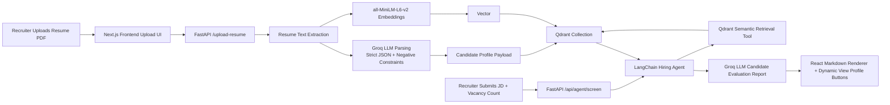
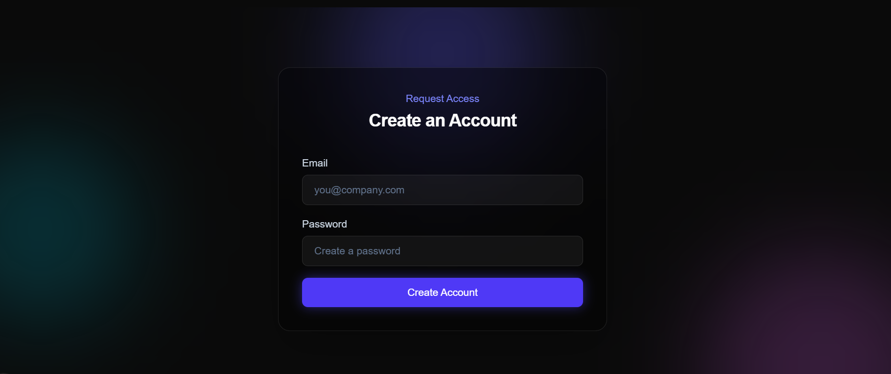

# Nexus AI: Enterprise Talent Intelligence


Nexus AI is an enterprise-ready Applicant Tracking System (ATS) that combines resume parsing, semantic search, and AI-based candidate evaluation into one unified hiring command center.

It is designed for teams that want speed, explainability, and reliability when shortlisting talent at scale.


---

## Table of Contents

1. [System Architecture](#system-architecture)
2. [Product Tour (User Journey)](#product-tour-user-journey)
3. [Core Technical Features](#core-technical-features)
4. [Engineering Challenges Solved](#engineering-challenges-solved)
5. [Tech Stack](#tech-stack)
6. [Local Installation](#local-installation)
7. [Environment Variables](#environment-variables)
8. [API Surface](#api-surface)

---

## System Architecture



### Architecture Notes

- **Ingestion path:** Resume -> parsing -> structured profile + embedding -> Qdrant upsert.
- **Retrieval path:** Job Description -> LangChain agent tool call -> semantic candidate retrieval.
- **Decision path:** LLM produces formatted evaluation reasoning used directly by the UI.
- **Control path:** Dashboard supports list/search/view/delete/delete-all operations for candidate records.

---

## Product Tour (User Journey)

### 1) Authentication Flow

Recruiters can create an account and sign in through a lightweight JSON-backed auth system (`backend/users.json`) with JWT issuance.

<p align="center">
  
  
</p>

### 2) Data Ingestion: Upload Resumes

Users drag and drop resumes, then upload to the ATS backend for parsing and vector storage.


### 3) Master Control Room

The Candidate Database view provides:

- Global candidate visibility in one table
- Search by name, email, or skill keywords
- `Total` candidate badge
- Bulk actions (`Delete Selected`, `Delete All`)
- Rich modal profile inspection

<p align="center">
  
  
</p>

### 4) AI Hiring Agent

Recruiters paste a Job Description, define vacancy count, and receive a structured AI evaluation report grounded in Qdrant retrieval.

<p align="center">
  
  
</p>

---

## Core Technical Features

- **RAG-powered recruiting workflow**
  - Embeds resume text with `all-MiniLM-L6-v2` (384-dim vectors).
  - Stores vectors + structured candidate payloads in Qdrant.
  - Retrieves semantically relevant candidates for job-specific evaluation.

- **Strict structured resume parsing**
  - Uses Pydantic schemas for candidate profile validation.
  - Enforces explicit extraction schema for `name`, `email`, `skills`, `education`, and chronological `work_history`.
  - Applies negative constraints to avoid pulling summary/objective text into experience details.

- **Experience computation with overlap-safe logic**
  - Converts parsed work intervals into merged month ranges.
  - Prevents double-counting overlapping jobs.
  - Returns rounded `years_experience` for ranking/display consistency.

- **Agentic hiring evaluation**
  - Uses a LangChain tool-calling agent to force candidate retrieval before recommendation.
  - Produces structured markdown reasoning per candidate.
  - Supports recruiter-controlled shortlist size via `num_candidates`.

- **Operational candidate management**
  - List all candidates from Qdrant payloads.
  - Delete one, many, or all records through API-driven operations.
  - UI and backend remain synchronized through explicit record IDs.

- **Dynamic post-processing of LLM report content**
  - React hooks scan generated markdown for candidate mentions.
  - Substring conflict filtering removes false-positive partial-name matches.
  - Deduplication by email/id ensures each candidate appears once in action buttons.

---

## Engineering Challenges Solved

### 1) Bypassing OS-Level File Locks in Qdrant Delete-All

**Problem:** Dropping/recreating local collections can trigger file-lock conflicts on Windows, especially under active process handles.

**Solution:** Refactored mass cleanup to point-level deletion using an empty `FilterSelector`:

```python
client.delete(
    collection_name=QDRANT_COLLECTION_NAME,
    points_selector=models.FilterSelector(
        filter=models.Filter()
    )
)
```

**Impact:** Stable "Delete All" behavior without destructive folder-level operations or lock-related crashes.

### 2) Handling Groq API Rate Limits (HTTP 429)

**Problem:** Resume parsing and filter extraction can fail under burst traffic when the LLM endpoint throttles requests.

**Solution:** Implemented retry loops with rate-limit detection (`RateLimitError` or `429` message checks) and cooldown sleeps before retry.

**Impact:** Higher ingestion reliability and fewer recruiter-facing failures during peak usage.

### 3) Strict LLM Constraints to Minimize Hallucinations

**Problem:** Raw LLM parsing may blend unrelated resume sections, causing profile drift and unreliable candidate fields.

**Solution:** Added:

- strict JSON-only response contract
- schema validation with Pydantic
- negative constraints excluding summary/objective text from experience extraction
- explicit formatting requirements for candidate reasoning blocks using double line breaks (`\n\n`)

**Impact:** Cleaner structured data, predictable markdown rendering, and better downstream candidate ranking quality.

### 4) Dynamic React Hook Deduplication for Interactive Buttons

**Problem:** LLM-generated markdown can mention names inconsistently, leading to duplicate or incorrect "View Profile" actions.

**Solution:** Built a deterministic frontend pipeline:

1. candidate name mention detection from report text
2. substring suppression (ignore names that are subsets of longer matched names)
3. identity deduplication by email (fallback: candidate ID)

**Impact:** Accurate, stable, and user-trustworthy profile actions from unstructured LLM output.

---

## Tech Stack

### Frontend

- Next.js (App Router)
- React
- TypeScript
- Tailwind CSS
- Framer Motion
- React Markdown
- React Dropzone

### Backend

- Python
- FastAPI
- Pydantic
- Uvicorn

### AI and Retrieval

- Groq API
- LangChain + LangChain Groq
- Sentence Transformers (`all-MiniLM-L6-v2`)
- Qdrant Vector Database

### Data and Auth

- JSON-backed user store (`users.json`)
- JWT-based session token issuance

---

## Local Installation

### Prerequisites

- Node.js `18+` (Node `20+` recommended)
- npm
- Python `3.10+`
- Qdrant running on `localhost:6333`
- Groq API key

Optional for OCR/DOCX parsing paths:

- `tesseract-ocr` installed on your machine
- Poppler tools (for `pdf2image`)

### 1) Clone and Enter the Repository

```bash
git clone <your-repo-url>
cd nexus-ai-ats
```

### 2) Start Qdrant (Docker)

```bash
docker run -p 6333:6333 -v %cd%/qdrant_storage:/qdrant/storage qdrant/qdrant
```

If you are on macOS/Linux, replace `%cd%` with `$(pwd)`.

### 3) Backend Setup (FastAPI)

```bash
cd backend
python -m venv .venv
```

Windows PowerShell:

```bash
.venv\Scripts\Activate.ps1
```

macOS/Linux:

```bash
source .venv/bin/activate
```

Install dependencies:

```bash
pip install -r requirements.txt
```

Install additional runtime packages used by parser/agent modules if needed:

```bash
pip install langchain langchain-groq python-docx pytesseract pdf2image pyjwt
```

Run API server:

```bash
uvicorn main:app --reload --host 0.0.0.0 --port 8000
```

Backend URLs:

- API base: `http://127.0.0.1:8000`
- Health: `http://127.0.0.1:8000/health`
- Swagger UI: `http://127.0.0.1:8000/docs`

### 4) Frontend Setup (Next.js)

Open a new terminal:

```bash
cd frontend
npm install
npm run dev
```

Frontend URL:

- `http://localhost:3000`

### 5) Default Login (If No Users Exist Yet)

When `backend/users.json` is empty/missing, the backend seeds:

- Email: `admin@ats.com`
- Password: `password123`

---

## Environment Variables

Create `backend/.env`:

```env
GROQ_API_KEY=your_groq_api_key
QDRANT_HOST=localhost
QDRANT_PORT=6333
QDRANT_COLLECTION_NAME=resumes
JWT_SECRET=super-secret-ats-key
```

---

## API Surface

### Authentication

- `POST /api/auth/register`
- `POST /api/auth/login`

### Ingestion and Search

- `POST /upload-resume`
- `POST /search`
- `GET /health`

### Candidate Management

- `GET /api/candidates`
- `DELETE /api/candidates`
- `DELETE /api/candidates/all`

### AI Hiring Agent

- `POST /api/agent/screen`

---

## Why Nexus AI

Nexus AI is not just an ATS UI. It is a full retrieval-and-reasoning hiring system that addresses real-world operational issues: noisy resumes, rate limits, vector-database lifecycle reliability, and explainable AI decision support for recruiters.

If you are evaluating this project for engineering depth, focus on the parsing constraints, the Qdrant deletion strategy, and the deterministic frontend post-processing around LLM output. Those design choices are what make the system robust in practice.
